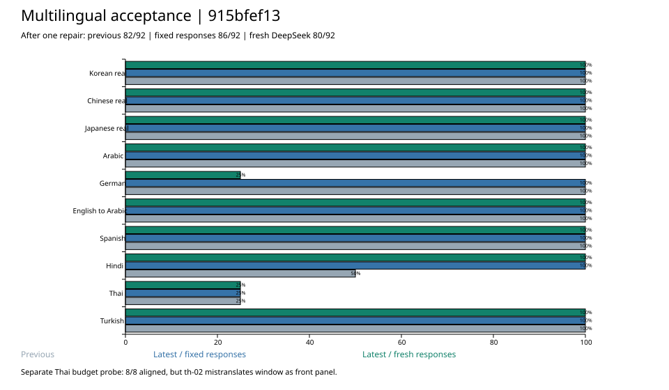

# 多语言验收：915bfef13

结论：**印地文引用修复通过；泰文分词在带预算的输入中可完成对齐，但仍有内容错误；整体不能判为全部通过。**

本轮以 `915bfef1308a070c0a720682b961744cf156ec4b` 开始构建；期间其他会话提交了 Web/wasm 改动，收尾 HEAD 为 `e3ec02730`。构建前后 `bcut-flow-core`、`bcut-engine`、`bcut-speech-core` 全部 Rust 源文件摘要一致。本轮不修改生产代码。

## 与上轮对比

使用[上轮验收](../lean-carrier-acceptance-2026-10-01/README.md)相同的 92 句（36 句真实项目抽样、56 句合成），模型配置 ID 为 `deepseek-flash`（用户指定的 DeepSeek V4.1 Flash）。

| 口径 | 首轮接收 | 首轮对齐 | 一次补做后接收 | 一次补做后对齐 | 最终需重写 |
| --- | ---: | ---: | ---: | ---: | ---: |
| 上轮新模型结果 | 92 | 79 | 92 | 82 | 10 |
| 最新代码回放上轮响应，保留上轮输入 | 92 | 83 | 92 | **86** | 6 |
| 最新代码回放上轮响应，合成文本按新版分词 | 92 | 83 | 92 | **86** | 6 |
| 最新代码新调模型，合成文本按新版分词 | 91 | 77 | 92 | **80** | 12 |

分母均为 92。固定响应控制了模型输出，确认代码提升 4 句，来自印地文。新调用只做一轮，不能把 82→80 当成确定性算法回归：德文→英文 6 句这次都只返回一个大块，补做也未拆开；印地文则从 4/8 提升到 8/8。三组真实项目本轮补做后全部 36/36 对齐，中文其中 1 句首轮格式失败、补做恢复。



| 源语言组 | 样本 | 上轮对齐 | 新版固定响应回放 | 新版新响应 |
| --- | ---: | ---: | ---: | ---: |
| 韩文真实 | 12 | 12 | 12 | 12 |
| 中文真实 | 12 | 12 | 12 | 12 |
| 日文真实 | 12 | 12 | 12 | 12 |
| 阿拉伯文 | 8 | 8 | 8 | 8 |
| 德文 | 8 | 8 | 8 | 2 |
| 英文→阿拉伯文 | 8 | 8 | 8 | 8 |
| 西班牙文 | 8 | 8 | 8 | 8 |
| 印地文 | 8 | 4 | 8 | 8 |
| 泰文 | 8 | 2 | 2 | 2 |
| 土耳其文 | 8 | 8 | 8 | 8 |

## 泰文带预算补测：结构通过，内容未通过

原合成基准没有 `data-budget`，不会触发部分生产分块提示。本轮另取相同的 8 条泰文，注入模拟阅读预算，单列结果，不并入 92 句主表。

- 模拟时长 = 参考英译词数 / 2.7；预算按当前 `reading_budget_duration` 计算，英文 21 单位/秒、中文 9 单位/秒。它们是实验假设，不是真实媒体时间。
- 首轮 **8/8 接收、8/8 aligned**；36 个块定位到 35 个。
- `th-04` 有一处引用将 `เมื่อวาน` 写成 `เมื่อยาน`，仍有 `anchor-unresolved`，但规划器利用其余证据生成了对齐。不能把 8/8 aligned 写成所有引用正确。
- **`th-02` 新发现确定的内容错误：** 原文 `ปิดหน้าต่าง` 是关窗，新译文是 `close the front panel`。最终仍为 `aligned`，并在 `front | panel` 之间产生了字幕分段。
- 本次提示包含 `ต่ำกว่า5อง ¦ ศาให้ปิดหน้า ¦ ต่างก่อนเปิดเครื่อง`，将 `องศา`（度）及 `หน้าต่าง`（窗户）拆开。模型响应同样写出 `de|grees`、`front | panel`；最终整理合并了 degrees，但没有纠正 front panel。提示断点与错误相伴出现，单次采样不足以证明因果。

建议下一步优先验证：对低可信度的源词边界不强制下发 `¦`，用“保留完整源句、只要求目标文本分块”的对照臂重复采样；同时加入 `th-02` 的关键词和关系检查。应先确认断点提示不会诱发误译，再提高分块成功率。不要用增加重试次数代替这项验证。

## 原未通过项复查

- **印地文引用定位：通过。** 固定回放的 `hi-03`、`hi-05`、`hi-06`、`hi-07` 全部从 needs-rewrite 转为 aligned；新模型 8/8 对齐。
- **泰文分词：有条件通过结构测试。** 新版 `atomize-words` 为 th-01/th-02 生成 16/19 个词单元；10 个分词与 glue 拼接探针均保持原文，含泰、老挝、高棉、缅甸文。保持文本不等于语言学分词准确，`หน้า/ต่าง` 等拆分仍需处理。
- **德文 `de-07` 语义：未解决。** 新响应仍是“只有在第二版负责人同意后，才把文件发给安娜。”源文要求管理层批准第二版。新增 `translation-meaning-unverified` 只是如实报告语义未核对；相关测试通过，但没有自动修复该误译。
- **印地文 `hi-07` 语义：不作确定错误计数。** 新响应仍写“另一个版本”；原词有“第二/另一个”读法，需要上下文或母语复核。更正上轮过强的错误归因，本轮只记录歧义。
- **西班牙文 `es-06`：** 新响应保留 Inés / Mateo 和“先出发、晚到十分钟”的关系。
- **交叉区间：** 10 种语言 × 100 种双区间组合，误放行 0；各组仍有 15 个安全断点通过。这个探针只覆盖指定双区间形状。

## 构建与测试

清理 `bcut-flow-core` / `bcut-engine` 后重新构建两个 example，构建 20.43 秒。`bcut_flow_core`、`bcut_engine`、`lean_carrier_grade`、`provider_carrier_bench` 四个 artifact 均 `fresh: false`；复制新二进制后测试。保留一条既有 `unused_mut` 编译警告。

| 测试 | 通过 | 忽略 | 失败 |
| --- | ---: | ---: | ---: |
| bcut-flow-core（单元、golden、carrier） | 958 | 1 | 0 |
| bcut-speech-core | 46 | 0 | 0 |
| bcut-engine（单元与架构检查） | 210 | 0 | 1 |

失败项为 `provider_http_calls_are_built_in_exactly_one_place`：扫描命中 `bcut-audio-gen/src/http.rs:132` 和 `bcut-image-cloud/src/http.rs:238` 的 `auth_headers`。测试及两个命中文件与上轮验收代码相比无差异，本次提交前的开发日志也已记录该失败。它仍是当前红门，未修改或跳过。

引擎测试失败后，另外运行 flow-core / speech-core，确保它们实际执行完毕。未运行 App/Web/wasm 验收、全 workspace 测试、完整 Runtime 翻译事务或视频导出。测试数据没有经过母语人工盲评。

三个真实项目的本地只读投影检查共 **346 句**（韩 73、中 84、日 189），输出与上轮逐字节相同，源文件 SHA-256 前后一致。没有向模型发送完整项目语料。

本轮模型调用 22 次：主集首轮 16 页、一次补做 4 页（15 句）、泰文模拟预算 2 页；全部成功。新模型结果只代表这次采样。

## 保存与复验

`pages/`、`requests.json`、`fix-requests.json`、`budget-requests.json`、`responses/` 保存全部实际输入和模型回答；`first-grades/` 固定首轮选择，确保修复行号对应正确。三个 `*-summary.json` 保存固定输入回放、新分词回放、新模型评分；`budget-summary.json` 单列模拟预算结果。其余 JSON 保存构建、源码摘要、区间探针与真实项目检查。

从仓库根运行（必须先构建最新 grader）：

```bash
cd core && cargo build --locked -p bcut-flow-core --example lean_carrier_grade
cd ..
BCUT_BENCH_TARGET="$(cd core && cargo metadata --no-deps --format-version 1 | python3 -c 'import json,sys; print(json.load(sys.stdin)["target_directory"])')"
python3 scripts/bench/fixtures/lean-carrier-acceptance-2026-10-01-915bfef13/replay.py \
  --grader "$BCUT_BENCH_TARGET/debug/examples/lean_carrier_grade"
```

脚本回放主集及泰文预算补测，不调用模型；先核对首轮，再核对合并结果。未来代码变化导致断言失败时应审阅差异，保留这份历史记录。
