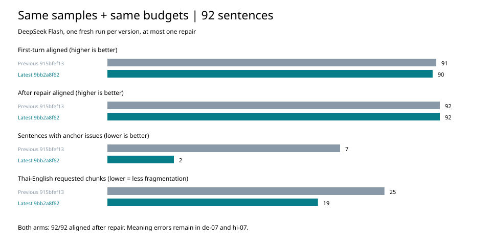

# 最新版验收：9bb2a8f62

**结论：结构与自动回归通过；语义验收仍未通过。** 本轮最新版本与预算匹配的旧版本都在一次补做后达到 92/92 接收、92/92 对齐。最新版不能据此宣称提高了最终对齐通过率；观察到的改进是引用问题更少、泰文分块提示更少。单轮模型采样不等于稳定收益。

## 版本与方法

- 最新版：`9bb2a8f62`；上轮版本对照：`915bfef13`，使用上轮保存的 grader 二进制，其 SHA-256 保存在 `source-verification.json`。
- 样本：沿用 92 句（韩、中、日真实项目各12句，加56句合成）。本次没有扩大真实项目外发范围。
- 两组使用**完全相同的源载体、manifest、阅读预算**；分别由对应版本渲染协议/提示、解析响应并评分，provider 执行器统一使用本轮重新构建的版本。
- 阅读预算按现行 `reading_budget_duration`：时长 × 目标语 cps，向下取整（zh=9、ja/ko=13、其余=21）。36句真实样本用原词首尾时间，56句合成样本用参考英译词数/2.7估计，英文源文直接用源词数/2.7。假设逐句保存在 `budget-assumptions.json`，不是实测阅读时长。
- 使用用户指定的 DeepSeek V4.1 Flash（配置ID `deepseek-flash`），temperature=0.2、effort=auto。每组独立采样一次，最多补做一次；最新版18次调用、旧版17次调用，共35次，全部请求成功。
- 不带预算的历史92句另外固定响应回放，**与上轮完整逐句评分一致**，仍是80/92对齐。该组用于无回归检查，不能代表生产分块提示的效果。

## 相同预算的版本对比

| 指标 | 旧版915bfef13 | 最新9bb2a8f62 |
| --- | ---: | ---: |
| 首轮接收 / 对齐 | 91/92 | 90/92 |
| 一次补做后接收 / 对齐 | 92/92 | 92/92 |
| 首轮有引用问题的句子 | 7 | 2 |
| 首轮定位到的块 / 全部块 | 440/441 | 425/425 |
| 泰文→英文6句请求的最少块数合计 | 25 | 19 |
| 三个真实项目抽样最终对齐 | 36/36 | 36/36 |

首轮引用问题是评分器的问题标记，不能当作全部译文质量的统计；上表两组接受句数也不同。所有语言组补做后均达到其全部样本数。最新版中文 `s-g133.0`、日文 `s-g165.0` 首轮未接收，经补做恢复。未发现 needs-rewrite 或 sentence-level 残留。



中日文的新词典边界门在本批中改变了中文7句、日文8句提示文本；提示总块数没有变化，变化在源侧断点位置。泰文→英文减少6个请求块，约24%。这批样本没有重现先前“120 | baht”式过碎分块的整体问题，但未对每条字幕做母语流畅度评分。

## 内容复查：仍不能全绿

1. **德文 de-07 未解决。** 新响应“只有在第二版负责人批准后，才把文件发给安娜。”仍将“管理层批准第二版”误读为“第二版负责人批准”。被判为 aligned。
2. **印地文 hi-07 有确定遗漏。** 新响应“在经理批准另一个版本之前，不要把文件全部发出去。”漏掉收件人 Sara，增加“全部”。这里不以“第二版/另一个版本”的歧义作为错误依据。旧版同预算响应也有相同错误；本次不能归因于新增分块规则。
3. **泰文 th-02 在本轮未重现错误。** 新、旧同预算响应均正确写出“close the windows”；保留低于5度、先关窗再开暖气。单次成功不能证明“front panel”错误永久消失。
4. `th-05` 最新译文在引号后有额外空格（`“ confirmed”`）；泰文→中文两句缺少自然停顿标点，仍有文字质量改进空间。它们不影响本轮结构通过计数。

语义结论来自对已保存文本的人工式复查，未做母语盲评或使用独立模型复核，不报告语义准确率。设计中的跨模型意思核查试验尚未接入生产，本轮不把它当成已经落地的保护。

## 润色、多语言与安全边界回归

`cargo test --locked -p bcut-flow-core -p bcut-speech-core -p bcut-engine`：

| 范围 | 通过 | 忽略 | 失败 |
| --- | ---: | ---: | ---: |
| flow-core（含golden、carrier、多语言） | 968 | 1 | 0 |
| speech-core | 47 | 0 | 0 |
| engine | 211 | 0 | 0 |
| 合计 | **1226** | **1** | **0** |

- 新增的多语言用例现为25个场景、50个润色/翻译任务；三项数据驱动回归全过，含词ID/时间保持、照抄源文拒收和词内分块保护。它们使用固定答案，本轮没有新调用润色模型。
- 上轮 `provider_http_calls_are_built_in_exactly_one_place` 架构检查已通过。
- 1000个双区间交叉探针：误放行0；每组仍有15个安全断点通过。
- 10个Unicode分词与glue拼接探针全部保持原文。
- 三个真实项目共346句的本地投影与上轮逐字节一致，源文件SHA-256前后一致；没有写回真实项目。

构建前清理 flow-core / engine，重新构建 `lean_carrier_grade` / `provider_carrier_bench`，耗时15.92秒；四个相关artifact均 `fresh: false`。测试使用复制出的本轮二进制；三个相关crate源码摘要前后一致。保留一条既有unused_mut警告。未做App/Web UI、视频导出、完整Runtime翻译事务或全workspace验证。

## 文件与复验

- `pages/`：两组共用的预算输入与manifest。
- `latest/`、`previous/`：分别保存精确请求、原始响应、首轮评分及最终逐句结果。
- `replay-summary.json`：最新版对上轮旧响应、旧输入的回放，与上轮记录完全一致。
- `build-proof.json`、`source-verification.json`：版本、编译新鲜度、测试计数与源码/二进制摘要。
- `property-results.json`、`real-project-check.json`：交叉探针、Unicode及真实项目检查。

复验最新版（不调用模型）：

```bash
cd core && cargo build --locked -p bcut-flow-core --example lean_carrier_grade
cd ..
BCUT_BENCH_TARGET="$(cd core && cargo metadata --no-deps --format-version 1 | python3 -c 'import json,sys; print(json.load(sys.stdin)["target_directory"])')"
python3 scripts/bench/fixtures/lean-carrier-acceptance-2026-10-01-9bb2a8f62/replay.py \
  --grader "$BCUT_BENCH_TARGET/debug/examples/lean_carrier_grade"
```

核对旧臂需传 `--arm previous` 并使用915bfef13对应grader；不要用最新版覆盖旧评分。代码后续有意变化时审阅差异并另建验收记录。
