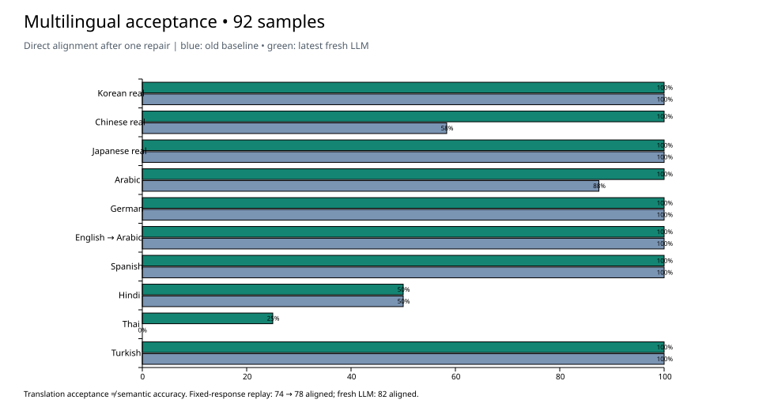

# 多语言验收：2026-10-01

验收代码：`6f710387a`。固定数据来自 [2026-09-30 的 92 句基准](../lean-carrier-multilingual-2026-09-30/README.md)，其中真实项目抽样 36 句、合成 56 句。结论：**修复有效，仍未达到全部语言可直接交付字幕的标准。**

## 结果

| 口径 | 译文接收 | 直接对齐 | 需重写切分 | 整句退化 | 缺译 |
| --- | ---: | ---: | ---: | ---: | ---: |
| 旧版首轮 | 51 | 38 | 4 | 9 | 41 |
| 新版首轮，同一批旧响应 | 50 | 39 | 11 | 0 | 42 |
| 旧版，一次修复后 | 87 | 74 | 4 | 9 | 5 |
| 新版，同一批旧响应及旧修复 | 86 | 78 | 8 | 0 | 6 |
| 新版，新 DeepSeek 首轮 | 92 | 79 | 13 | 0 | 0 |
| 新版，新 DeepSeek 一次修复后 | 92 | 82 | 10 | 0 | 0 |

所有分母均为 92。旧响应少接收的 1 句是西班牙文 `es-06`：旧版把源文残片和引用标记当译文接收，新版正确拒绝。固定响应回放的对齐提升为 **4 句**；新模型测试相较历史基准提升为 **8 句**，包含提示词、输入分词及模型采样差异，不能全归因于算法。



| 源语言组 | 样本 | 旧修复后对齐 | 新修复后对齐 |
| --- | ---: | ---: | ---: |
| 韩文真实 | 12 | 12 | 12 |
| 中文真实 | 12 | 7 | 12 |
| 日文真实 | 12 | 12 | 12 |
| 阿拉伯文 | 8 | 7 | 8 |
| 德文 | 8 | 8 | 8 |
| 英文→阿拉伯文 | 8 | 8 | 8 |
| 西班牙文 | 8 | 8 | 8 |
| 印地文 | 8 | 4 | 4 |
| 泰文 | 8 | 0 | 2 |
| 土耳其文 | 8 | 8 | 8 |

## 未通过项与建议

1. **语义错误仍会被判为 aligned。** `de-07` 原文要求“管理层批准第二版后，才向 Anna 发送文件”；新回答为“只有在安娜收到文件并且第二版的负责人同意后，才发送。”添加了“已收到”条件，且误解批准对象。旧版的同一句也有错误。建议在现有语言/格式校验之外，对带条件、否定、人物角色的句子增加内容核查；评测中把“对齐成功”和“关键事实正确”分别计分。不能以本轮 100% 接收率宣称翻译准确率 100%。
2. **印地文 4 句仍无法定位。** `hi-03`、`hi-05`、`hi-06`、`hi-07` 一次补做后仍为 `anchor-unresolved`。响应包含 `लेकिन..नहीं..था` 等多段省略标记，以及源文不存在的端点组合。建议修复请求携带具体失败引用、失败原因与可选择的源词端点，并单独验证合法性；本轮补做按 grader 的 `render-fix` 接口生成，未覆盖完整生产编排的所有补做波次。
3. **泰文→英文 6 句仍切分过粗。** 引用已能定位，但重新分词后缺少足够句内源词边界，一次补做仍原样返回整句。下一步应补可保留词 ID/时间映射的泰文分词或子词边界方案，再验证连续区间与字幕长度，而不是继续原样重问模型。
4. **印地文 `hi-07` 仍有内容风险。** 样本要求“第二版”，新回答及补做均写“另一个版本”。这是本次内容复查发现的偏差，未做母语人工盲评或完整语义准确率统计。

## 已确认的修复

- 中文真实项目 12 句：从历史首轮 0 接收、补做后 7 对齐，变成本轮首轮 12 接收且 12 对齐。先前源文照抄/错误目标语问题在本批未重现。
- `es-06` 旧错误回答被拒绝，新回答完整保留 Inés / Mateo 及“先出发、晚到十分钟”。
- 1000 个双区间交叉探针：误放行 0；各语言仍有 15/100 个安全断点通过，未退化为全部拒绝。
- 6 个 Unicode 分词往返探针全部保持原文；之前失败的泰文 `พื้นที่` 和韩文 `도쿄 여행` 已通过。
- 韩/中/日真实项目本地读取及派生投影：73 / 84 / 189 句，3436 / 2461 / 6580 词；全部成功，读取前后文件 SHA-256 一致。这不是完整 346 句的新模型翻译测试。

## 构建与测试

先 `cargo clean -p bcut-flow-core -p bcut-engine`，再构建 `lean_carrier_grade` 与 `provider_carrier_bench`。构建耗时 118 秒（不含等待其他任务释放锁），四个组件均 `fresh: false`。复制本轮可执行文件后测试；测试范围内 Rust 源码与构建前摘要一致。

`cargo test --locked -p bcut-flow-core`：913 单元测试 + 3 golden + 20 carrier = **936 通过，1 忽略，0 失败**。未编译或验证 App/Web UI，也未执行导出视频播放或完整 Runtime 翻译事务。

新模型使用用户指定的 DeepSeek V4.1 Flash（配置 ID `deepseek-flash`），首轮 16 页、一次补做 5 页 / 13 句，21 次调用全部成功。只发送固定抽样集，未发送三个项目完整语料。模型采样仅一轮，不代表稳定通过率。

## 文件与复验

- `requests.json` / `fix-requests.json`：本轮精确请求；`responses/`：21 个模型原始响应。
- `pages/`：本轮源载体及 manifest。真实样本保持原词和时间；合成样本以新版 `atomize` 重建词。
- `live-summary.json`：新响应逐句评分；`replay-summary.json`：旧输入、旧响应的新版评分；`reatomized-summary.json`：重建合成分词后的旧响应评分。本次后两者总计相同。
- `property-results.json`：交叉探针及 Unicode 往返；`real-project-check.json`：真实项目本地检查。
- `build-proof.json` / `source-verification.json`：版本、源码摘要、构建新鲜度与测试产物摘要。
- `replay.py`：回放本轮新响应并与已保存结果逐句核对，不调用模型。

```bash
cd core && cargo build --locked -p bcut-flow-core --example lean_carrier_grade
cd ..
BCUT_BENCH_TARGET="$(cd core && cargo metadata --no-deps --format-version 1 | python3 -c 'import json,sys; print(json.load(sys.stdin)["target_directory"])')"
python3 scripts/bench/fixtures/lean-carrier-acceptance-2026-10-01/replay.py \
  --grader "$BCUT_BENCH_TARGET/debug/examples/lean_carrier_grade"
```

该回放会先核对首轮结果，再以相同首轮选择生成修复页，避免版本变化后将旧修复行号映射到错误的句子。后续有意修改算法时，应审阅差异并另存新验收记录。
