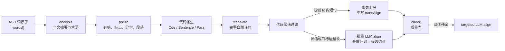

> 移植自 BaoCut v2；文中的数据模型名（TranscriptDoc 等）指 v2 的模型，与 v3 文档模型的对应见[架构设计 §14](../../architecture/architecture-design.md#14-待评审事项)。

# bcut 转录后字幕管线实现说明

本文解释 bcut 当前在完成语音转录后，如何把词级 ASR 结果依次变成可编辑、可翻译、
可导出的字幕。重点覆盖四个容易混淆的阶段：

- `segment`：语义段落规划；
- `polish`：纠正 ASR、补标点、分句，并在首次运行时顺带生成段落；
- `translate`：按完整语义句生成自然译文；
- `align`：把完整译句拆成可展示的字幕片，并重新锚定到源词时间轴。

本文以 2026-07-30 的工作树实现为准。格式和设计背景仍可参考
[bcut AI 管线设计](bcut-ai-pipeline-design.md)与
[Transcript v0.3 设计](bcut-transcript-v03-design.md)，但本文优先描述当前 Rust
代码实际执行的路径。

## 1. 先说结论

### 1.1 `words[]` 是唯一持久化的文本和时间真相

bcut 不把 Cue、Sentence、Paragraph 当成另一套可独立修改的字幕正文。项目中的
`transcript.json` 以 `words[]` 为核心：

```jsonc
{
  "words": [
    {
      "id": "g1.0",
      "t0": 9.93,
      "t1": 10.20,
      "text": "Now,",
      "sp": "s1"
    },
    {
      "id": "g1.1",
      "t0": 10.20,
      "t1": 10.61,
      "text": "ChatGPT",
      "sp": "s1"
    }
  ]
}
```

每个词同时拥有：

- 稳定 id；
- 媒体时间 `t0..t1`；
- 当前文本；
- 说话人 id。

后续所有结构都从词流派生，或者以词 id 为键写入稀疏覆盖表。这样可以保证：

1. LLM 永远不直接决定时间戳；
2. 修改少量文本时，未变化词的 id 和时间可以保持不动；
3. Cue、句子、段落和译文切片可以随时重新推导；
4. 每个阶段是否过期可以通过指纹计算，而不是依赖易漂移的流程状态。

对应实现：

- [`doc.rs`](../../../core/crates/bcut-flow-core/src/doc.rs)
- [`cue.rs`](../../../core/crates/bcut-flow-core/src/cue.rs)
- [`sentence.rs`](../../../core/crates/bcut-flow-core/src/sentence.rs)

### 1.2 `segment` 和“字幕拆行”不是一回事

在 bcut 中：

- `segment` 决定话题段落，最终写入 `paraBreaks`；
- `derive_cues` 决定源字幕如何换行；
- `derive_sentences` 决定翻译的完整语义句；
- `align` 决定完整译句如何拆成目标字幕片。

因此，“segment”更接近文章的段落组织，而不是 SRT 中的每一条字幕。最终字幕行是
代码根据词、标点、停顿、宽度和 `transAlign` 动态派生的。

### 1.3 LLM 提议语义，代码维护边界、时间和不变量

整个管线的基本分工是：

- LLM 擅长理解全文、纠错、分句、段落规划、翻译和跨语言语义对应；
- Rust 代码负责分页、id 对账、文本覆盖检查、LCS 映射、词重绑、时间插值、
  指纹、拆分预算、连续区间校验、降级和导出投影。

不是“LLM 输出什么就保存什么”，而是“LLM 给候选答案，代码证明它可以安全落库”。

### 1.4 当前推荐的高性能路径

```bash
bcut auto video.bcut --polish --lang zh

bcut check video.bcut --for srt --lang zh --strict

# 仅在 check 仍有顽固对齐问题时定向重切
# bcut refine-align video.bcut --lang zh
```

实际阶段是：



首次 `polish` 会从自己的段落分组顺带写 `paraBreaks` 和 `stages.segment`，所以普通
翻译任务不需要先单独运行一次 `bcut segment`。单独的 `segment` 主要用于“需要段落
结构，但不希望润色正文”的任务。Subtitle Studio 默认把全部长句按批交给 LLM，
在首轮同时完成语义拆分与长度均衡；`refine-align` 只处理 check 后的顽固残余。

## 2. 持久层和派生层

### 2.1 层级关系

| 层级 | 是否持久化 | id | 用途 |
| --- | --- | --- | --- |
| Word | 是 | `g1.4` / `w...` | 文本、时间和说话人的唯一真相 |
| Cue | 否 | `q-<首词id>` | 源字幕展示行 |
| Sentence | 否 | `s-<首词id>` | 翻译、脏检测和对齐单位 |
| Paragraph | 否 | `p-<首词id>` | 话题段落、分页和编辑导航 |
| 完整译句 | 是 | `trans[lang][sentenceId]` | 目标语自然译文真相 |
| 对齐覆盖层 | 是 | `transAlign[lang][sentenceId]` | 完整译句的展示切法 |
| 目标字幕片 | 否 | — | 导出、Studio 和渲染消费的最终投影 |

严格关系是：

```text
word ⊂ cue ⊂ sentence ⊂ paragraph
```

一个 Sentence 可以覆盖多个 Cue。这样翻译模型可以看到完整语义句，不会被源语言的
视觉换行强行切断。

### 2.2 Cue 如何由代码派生

`derive_cues` 顺序扫描所有未隐藏词，并按照以下条件封口：

1. 手工 `break`；
2. 说话人切换；
3. 句末标点（无显式 `nobreak` 时无条件封口）；
4. 从句标点且当前行达到最小长度（破折号用更低门槛）；
5. 词间停顿至少 0.6 秒且当前行达到最小长度；
6. 加入下一词后行宽超过 `maxChars`（仅当下一词以从句/句末标点收尾且总宽仍在
   `maxChars + overflowSlack` 内时延长一词收入标点）。

默认参数为：

```text
maxChars = 42
pauseSec = 0.6
minClauseChars = 12
minPauseChars = 20
minDashChars = 6
overflowSlack = 8
minCueDisplaySec = 1.0
```

`nobreak` 可以抑制默认的句末、标点、停顿与溢出断点，但不能抑制手工强断和说话人
切换。

派生读取的钉表是 `autoBreaks[layoutProfile] ⊕ breaks`（transcript 0.4）：
`breaks` 只保存用户显式意图，`autoBreaks` 按 `LayoutProfile` id（缺省
`default`）保存优化器输出，同键以用户 `breaks` 为准。三端（Rust
`derive_cues`、Swift `TranscriptModel.cues`、designs 原型 `VK_MODEL.cues`）
只多做这一次 map 合并，派生算法本身不变。

派生保持贪心；阅读速度均衡（孤儿短尾回收、过快 Cue 的缝重排/合并、悬垂词尾
回避）由 `bcut-flow-core::layout` 的候选断点全局 DP 在润色/分段写回时一次性
计算：用户 `break`、说话人切换、`paraBreaks` 与句末是硬边界，用户 `nobreak`
是禁止边界，其余位置按缝等级（句末 0 < 从句标点 0.3 < 停顿 0.5 < 普通词间
0.8 < 悬垂尾 1.5 < CJK 词内 3.0）、阅读速度（`LayoutProfile` 的 warn/bad）、
时长（min/max duration，时窗按 lead-in/tail 借静音口径）、孤立短尾与欠满打
分整体选择。优化器**总是运行**（不再因已有钉集跳过），结果落成与 `auto_break`
重放不一致处的最小钉集写入 `autoBreaks[layoutProfile]`，**绝不写 `breaks`**；
派生端从 `words + autoBreaks ⊕ breaks` 重放即可复现。阈值来源是
`bcut-flow-core::layout_profile::LayoutProfile`（`default` = 既有全部常量）。

### 2.3 Sentence 如何由代码派生

`derive_sentences` 把连续 Cue 合并为翻译句。满足任一条件即封句：

1. 末词有句末标点；
2. 下一 Cue 与当前 Cue 的间隔至少 1.8 秒；
3. 说话人切换；
4. 当前句达到 80 个词；
5. 下一 Cue 的首词被 `paraBreaks` 钉住；
6. 下一 Cue 跨章节。

0.6–1.2 秒的停顿可以拆源 Cue，却不会自动拆翻译句。例如：

```text
An agent is an LLM with tools
    [0.62s pause]
running in a loop to accomplish
    [1.08s pause]
a goal.
```

这可以派生为三个源 Cue，但仍是一个完整 Sentence：

```text
An agent is an LLM with tools running in a loop to accomplish a goal.
```

这一区分对自然翻译非常重要。

### 2.4 Paragraph 如何由代码派生

`derive_paras` 按“章节 × 连续同说话人”分组，再叠加 `paraBreaks`。`paraBreaks`
是以“新段首词 id”为键的稀疏表：

```json
{
  "paraBreaks": {
    "g5.0": true,
    "g12.4": true
  }
}
```

这表示 `g5.0` 和 `g12.4` 分别开启一个新段，而不是保存一份重复的段落正文。

## 3. 哪些步骤依赖 LLM，哪些依赖代码

| 步骤 | LLM 负责 | Rust 代码负责 | LLM 失败后的行为 |
| --- | --- | --- | --- |
| Cue 派生 | 无 | 标点、停顿、宽度、覆盖表规则 | 不适用 |
| Sentence / Para 派生 | 无 | 句末、强停顿、说话人、章节、段落钉 | 不适用 |
| analysis | 摘要、术语、命名实体 | 分页、缓存指纹、变体过滤 | 非终止错误可忽略，继续无简报润色 |
| polish | 纠错、补标点、语义分句和分段 | LCS 映射、相似度门、rebind、时间修复、降级 | 保留原词，按句末/30 词规则切分 |
| standalone segment | 补标点和话题段落建议 | 覆盖证明、边界映射、说话人硬断、兜底 | 索引契约后再退到纯规则分段 |
| translate | 自然、忠实的完整句翻译 | 句派生、分页、CPS 预算、id 对账、增量落盘 | 重试耗尽后终止；不会伪造机器翻译 |
| `independent` align | 无 | 目标语 DP 拆分、比例词锚、时间平滑 | 不适用 |
| `manyToOne` align | 按双侧长度计划选择同步语义片 | 长句判定、候选词边界、覆盖/hard/lint 校验、全局修复预算 | 失败句退到确定性目标语切分 |
| check / export / Studio 投影 | 无 | stale、覆盖率、CPS、宽度、闪烁、时间投影 | 不适用 |

这里的“LLM 失败”不包括 401、403、模型不存在等终止性配置错误。这类错误会直接停止
任务，避免用降级结果掩盖配置问题。

## 4. 统一的 LLM 调用层

四个 AI 阶段都只依赖 `bcut-flow-core` 中的 `LlmJson` trait：

```rust
pub trait LlmJson {
    fn complete(&mut self, request: &LlmRequest) -> Result<String, LlmError>;
}
```

引擎本身没有网络和文件 I/O。CLI 提供两种执行器。

### 4.1 Provider 模式

```bash
bcut polish project.bcut --llm provider:openai/model-name
```

CLI 直接请求 OpenAI 兼容或 Anthropic API。大多数 provider 使用
`response_format={"type":"json_object"}`；不支持该参数的模型遇到对应 HTTP 400
后会去掉它重试。

### 4.2 Agent 模式

Agent 是默认模式：

```bash
bcut polish project.bcut --llm agent
```

每次调用都会创建文件：

```text
project.bcut/tasks/t-.../
├── contracts/polish.md
├── payloads/c0001.json
├── requests/c0001.json
├── claims/c0001.json
└── responses/c0001.json
```

外部 Agent 使用 `task claim` 领取调用，读取契约和 payload，把 JSON 答案写到临时
文件后通过 `task submit` 提交。引擎在收到 response 文件后继续执行。

Provider 和 Agent 的差别只在“谁生成回答”，不影响后续解析、校验、重试、落库和日志。

### 4.3 三层结构化校验

LLM 输出依次经过：

1. JSON-mode 提示或 provider 的 `response_format`；
2. `decode` 从响应中截取最外层 `{...}`，容忍 Markdown 围栏；
3. 每个引擎自己的确定性语义校验。

默认最多尝试 3 次，重试退避 2 秒，并把上次的具体问题通过 `retry_reason` 反馈给
下一次调用。

所有调用写入：

```text
project.bcut/logs/llm/<kind>.jsonl
```

记录 kind、执行器、模型或 worker、输入、响应、错误和耗时，可用于审计和性能分析。

## 5. Segment：段落规划

实现入口：

- [`segment.rs`](../../../core/crates/bcut-flow-core/src/engines/segment.rs)
- CLI：`bcut segment <project>`

### 5.1 LLM 看见什么

代码先把词流渲染为纯文本，并在词间加入只读元数据：

| 标记 | 触发条件 | 含义 |
| --- | --- | --- |
| `⏸` | gap ≥ 0.6s | 短停顿 |
| `⏸⏸` | gap ≥ 1.0s | 中停顿 |
| `⏸⏸⏸` | gap ≥ 1.8s | 长停顿 |
| `⏹` | 说话人发生变化 | 必须跨段 |

示意输入：

```text
Today we are launching ChatGPT ⏸ on web desktop and mobile ⏹
Now let us look at the data
```

Segment LLM 的任务很窄：

1. 逐字保留原文；
2. 只补充或修正标点；
3. 按话题组织成通常含 1–4 句的段落；
4. 不能跨说话人；
5. 返回：

```json
{
  "paragraphs": [
    "Today we are launching ChatGPT, on web, desktop, and mobile.",
    "Now let us look at the data."
  ]
}
```

### 5.2 代码如何证明答案能安全使用

当前实现的有效阶梯是：

#### Tier 1：exact

把源词和 LLM 段落都做 `normalize_chars`。它会忽略标点、空白和大小写。若两边字符流
完全相同，代码可用 O(n) 字符偏移把每个段落边界映射回词下标。

#### Tier 2：diff

如果模型顺手改了少量字符，代码对两侧运行相同的 `atomize`，再做 atom-LCS。匹配率
至少 0.75 才接受边界。

即便边界可恢复，只要某个段落文本与对应源词区间不能通过“只改标点”的严格文本门，
该段落的 LLM 文本也不会落库；代码只使用边界，正文退回原词。

#### Tier 3：当前省略

历史设计中存在一层游标式区间恢复；当前 Rust 实现明确省略它，直接升级到索引契约。

#### Tier 4：索引契约

三次文本契约都失败后，再发一次更简单的 LLM 请求：

```json
{
  "paragraphs": [
    {"startWordIndex": 0, "endWordIndex": 18},
    {"startWordIndex": 19, "endWordIndex": 31}
  ]
}
```

代码钳位范围、检查顺序和重叠，并自动吸附不超过 10 个词的小空隙。

#### Tier 5：确定性兜底

索引契约仍失败时，完全不再依赖 LLM，按以下规则切段：

- 说话人切换；
- 停顿至少 1.2 秒；
- 已有 200 字符后遇到句末；
- 400 字符硬断。

这条路径永不丢词。

### 5.3 写回什么

LLM 补充的合法标点通过 `rebind_corrected` 写回 `words[]`。段落边界则保存为新段首词
的 `paraBreaks`。现有人工段落钉不会被清除。

同时写：

```jsonc
{
  "stages": {
    "segment": "<id_fingerprint(words)>"
  }
}
```

`segment` 使用 id 指纹，所以纯文本变化但词 id 不变时，段落结构仍可保持 fresh；
重转录换发 id 后才会自然过期。

## 6. Polish：纠错、标点、分句与段落

实现入口：

- [`brief.rs`](../../../core/crates/bcut-flow-core/src/engines/brief.rs)
- [`polish.rs`](../../../core/crates/bcut-flow-core/src/engines/polish.rs)
- [`rebind.rs`](../../../core/crates/bcut-flow-core/src/rebind.rs)
- CLI：`bcut polish <project>`

### 6.1 先跑 analysis

CLI 会先读取 `ai/brief.json`。只有当其中的内容指纹与当前词流一致时才复用；否则调用
LLM 提取：

```json
{
  "summary": "视频介绍 ChatGPT 如何连接工具并完成工作。",
  "terms": [
    {
      "term": "ChatGPT",
      "note": "产品名",
      "observedVariants": ["Chat GBT"]
    }
  ],
  "namedEntities": ["ChatGPT", "Codex", "Mexico"]
}
```

长文按 8000 字符分页，多页结果再经过一次 LLM 合并。代码会删除没有在原文中实际出现
的 `observedVariants`，防止模型虚构错误变体。

Analysis 的普通失败不会阻塞 polish；只有鉴权等终止错误会停止任务。没有 analysis 时，
润色仍可运行，只是缺少全文摘要和术语锁。

### 6.2 Polish 的 LLM 契约

输入仍是带 `⏸` / `⏹` 的词流，但以带全局词下标的 JSON 传递：

```json
{
  "words": {
    "0": "Today",
    "1": "we",
    "2": "launch",
    "3": "Chat GBT ⏸",
    "4": "on",
    "5": "web"
  }
}
```

LLM 可以：

- 修明显 ASR 错误；
- 补标点；
- 按语义分句；
- 把连续句组织成段落。

不能翻译、改写、总结、增删或重排内容。响应不带时间和词下标：

```json
{
  "paragraphs": [
    {
      "sentences": [
        "Today we launch ChatGPT on web.",
        "It is also available on desktop and mobile."
      ]
    }
  ]
}
```

### 6.3 代码如何映射回词

1. 源词和输出句子使用同一个 `atomize`；
2. 对两侧做 atom-LCS；
3. 总匹配率低于 0.7，整页本次 attempt 失败；
4. 每个输出句由其最后一个匹配源词决定初始边界；
5. 相邻边界可在 ±10 词窗口内移动，但只有“两侧相似度都不下降，且至少一侧改善”
   才接受；
6. 边界移动不能破坏说话人一致性。

### 6.4 两层相似度保险

句级低相似度阈值为：

- Latin 文本：0.70；
- CJK 文本：0.75。

若一页中低相似句比例超过 30%，整页重试。否则先接受页结构，再把低相似句组成一个
`polish-retry` 调用，附带：

```json
{
  "startWordIndex": 120,
  "originalWords": "Chat GBT can do work",
  "previousAttempt": "ChatGPT can complete work",
  "contextBefore": "...",
  "contextAfter": "..."
}
```

重试仍不安全时，该句把 `corrected` 清空并标记 fallback，最终保留原词。

### 6.5 Rebind 如何保住时间轴

`rebind_corrected` 不会把 LLM 返回文本粗暴覆盖到原词数组：

1. 剥离公共前后缀；
2. 对变化区间做词级 LCS；
3. 匹配上的词原样保留 id、`t0`、`t1`；
4. 新 token 生成 `w...` id；
5. 新 token 在原时间窗内按字符权重插值；
6. 收尾做时间单调性和边界归一化。

示例：

```text
源词：
g1.3  2.00–2.60  "Chat"
g1.4  2.60–3.10  "GBT"

润色：
"ChatGPT"

结果：
w...  2.00–3.10  "ChatGPT"
```

变化区间可能换发 id，但其他词完全不受影响。翻译的 stale 检测因此可以精确到句。

### 6.6 Polish 首次运行为何也完成 segment

`run_polish` 的响应本来已经按段落组织。若 `stages.segment` 从未存在，代码会：

1. 取每个 LLM 段落的首词 id；
2. 从第二段开始写 `paraBreaks[id] = true`；
3. 写 `stages.segment = id_fingerprint(words)`；
4. 更新 `stages.asrLayout`。

所以标准翻译链中：

```text
transcribe → polish → translate
```

已经拥有分句和段落结构。提前单独运行 `segment` 会让 LLM 对同一全文再做一次相近工作，
增加延迟。

### 6.7 Polish 产物

除了更新 `transcript.json`，CLI 还写：

```text
ai/brief.json
ai/polish.json
```

`polish.json` 包含：

- 句记录和词 id / 时间范围；
- `typo` / `punct` 修改建议；
- 段落到句下标的分组；
- fallback 页数；
- 说话人实名候选。

## 7. Translate：完整语义句翻译

实现入口：

- [`translate.rs`](../../../core/crates/bcut-flow-core/src/engines/translate.rs)
- [`sentence.rs`](../../../core/crates/bcut-flow-core/src/sentence.rs)
- CLI：`bcut translate <project> --lang zh`

### 7.1 翻译单位不是 Cue

代码先派生 Cue，再把 1..N 个 Cue 合成 Sentence。翻译键是：

```text
s-<句首词id>
```

例如：

```text
q-g1.0  Now, ChatGPT goes from just answering questions
q-g1.7  to doing work for you by connecting to all of your tools.
```

可能形成一个翻译句：

```text
s-g1.0
Now, ChatGPT goes from just answering questions to doing work for you by
connecting to all of your tools.
```

### 7.2 增量选择

每句都会计算 `src_fingerprint`。翻译开始前，代码：

1. 删除已经不对应任何当前 Sentence 的 `trans`、`transSrc` 和 `transAlign` 孤儿键；
2. 找出没有译文的句；
3. 找出 `transSrc` 与当前句指纹不一致的 stale 句；
4. `--force` 时选择所有句；
5. 其他已有新鲜译文直接跳过，不产生 LLM 调用。

### 7.3 请求格式和阅读预算

待翻句按源文字符数打包，默认每页 6000 字符。相邻页只提供静态源文上下文，不依赖
前一页译文：

```json
{
  "lang": "zh",
  "context": "Preceding source: ...\nFollowing source: ...",
  "lines": [
    {
      "id": "s-g1.0",
      "source": "Now, ChatGPT goes from just answering questions to doing work for you by connecting to all of your tools.",
      "maxChars": 57
    }
  ]
}
```

`maxChars` 由句时长和目标语 CPS 预算计算：

```text
maxChars = max(1, floor(sentenceDuration × targetCps))
```

默认 CPS：

| 目标语 | CPS |
| --- | ---: |
| 简体中文 | 9 |
| 日文 / 韩文 | 13 |
| 泰文 | 15 |
| 阿拉伯文 / 印地文 | 18 |
| 其他语言 | 21 |

这个预算用于提示译文尽量简洁，但不能为了预算删除关键信息。

### 7.4 LLM 输出和代码校验

LLM 只返回完整译句：

```json
{
  "translations": {
    "s-g1.0": "现在，ChatGPT不再只是回答问题，还能连接你的所有工具，替你完成工作。"
  }
}
```

代码做双向 id 对账：

- 出现未知 id：拒绝；
- 缺少任一请求 id：拒绝；
- 任一译文为空：拒绝；
- 重复、合并或拆分句子：契约不允许。

翻译与对齐明确分成两个阶段，所以翻译模型可以使用自然目标语语序，不必迁就源 Cue
边界。

### 7.5 逐页持久化

每完成一页立即写：

```jsonc
{
  "trans": {
    "zh": {
      "s-g1.0": "现在，ChatGPT不再只是回答问题，还能连接你的所有工具，替你完成工作。"
    }
  },
  "transSrc": {
    "zh": {
      "s-g1.0": "19:g1.0:g1.18:..."
    }
  }
}
```

因此 `transcript.json` 本身就是断点续跑现场。进程在后续页失败时，已经完成的句仍然
存在；重跑会自动跳过它们。

与 segment / polish 不同，translate 没有“用规则生成近似译文”的降级。三次请求都
失败后命令返回错误，因为伪造一份不可靠译文比明确失败更危险。

## 8. Align：目标字幕拆分与时间锚定

实现入口：

- [`align.rs`](../../../core/crates/bcut-flow-core/src/engines/align.rs)
- [`split.rs`](../../../core/crates/bcut-flow-core/src/split.rs)
- [`seam.rs`](../../../core/crates/bcut-flow-core/src/seam.rs)

### 8.1 为什么翻译后还需要 align

完整译句是语言质量真相，但经常不适合一次上屏。例如：

```text
现在，ChatGPT不再只是回答问题，还能连接你的所有工具，替你完成工作。
```

它需要被拆成：

```text
现在，ChatGPT不再只是回答问题，
还能连接你的所有工具，替你完成工作。
```

同时还要回答：每个译片对应源句的哪些词，应该在什么时间显示。

### 8.2 三个预算

`TransParams` 为目标语言定义：

| 语言 | fit | soft | hard |
| --- | ---: | ---: | ---: |
| 中 / 日 / 韩 | 16 | 14 | 20 |
| 其他语言 | 42 | 30 | 42 |

- `fit`：触发拆分的单行容量；
- `soft`：希望每片接近的长度；
- `hard`：任何译片不能超过的硬上限。

简中预算先做非破坏性交付投影：

- 普通逗号、句号不占预算；
- 空白不计；
- 两个 Latin 半角格约等于一个汉字阅读单位；
- 数字中的 `1.2`、`1,000` 仍保留内部标点。

如果完整译句同时没有超过 fit 和 hard，代码会删除不必要的 `transAlign`，直接让整句
覆盖整个 Sentence 的词时间窗。源 Cue 数量和边界不参与该判断。

### 8.3 `independent`：纯代码、目标语优先

```bash
bcut translate project.bcut --lang zh --align-mode independent
```

代码把译句原子化，并用动态规划选择缝：

- 句末标点成本最低；
- 从句标点次之；
- 词间空白再次；
- CJK 字界最后；
- 每片不得超过 hard；
- 整体尽量接近 soft；
- 片数不能超过源词数。

切完后按译片累计阅读单位占比，把每片分配到至少一个连续源词。它不建立双语逐行语义
对应，适合目标语单语字幕。

### 8.4 `oneToOne` 历史兼容

该模式直接依赖源 Cue，已经停用。枚举值仅用于读取历史 JSON；CLI 会拒绝新请求，
历史条目会被视为无效并降级到 Sentence 整句投影，直到用 `many-to-one` 或
`independent` 重对齐。

### 8.5 `manyToOne`：默认的语义对齐

默认模式：

```bash
bcut translate project.bcut --lang zh --align-mode many-to-one
```

双侧都短的句不会调用 LLM。源语或目标语任一侧超长的句最多 32 句一批。代码为每句
计算语言感知的 `lengthPlan`：英文等空格分词语言按词数，中文/日文/泰文按阅读字符，
韩文按 eojeol（空格词组），同时仍受目标显示字符 hard 约束。块数同时受源语和目标语
驱动。每侧的 `preferredPerPiece` 是语义允许时的均衡目标，
不是破坏固定短语或语序交叉区的许可。

请求还列出所有合法的 `sourceBreakCandidates`。模型修订时只返回候选 id，不重抄
源文，因此不会再把 `faster—for` 这类单个 transcript token 从中间切开。

```jsonc
// 请求
{
  "budgets": {"fit": 16, "soft": 14, "hard": 20},
  "sentences": [
    {
      "key": "s-g1.0",
      "source": "Now, ChatGPT goes from just answering questions to doing work for you by connecting to all of your tools.",
      "target": "现在，ChatGPT不再只是回答问题，还能连接你的所有工具，替你完成工作。",
      "lengthPlan": {
        "pieceCount": {"min": 2, "max": 3, "recommended": 2},
        "source": {"lang": "en", "unit": "word", "total": 19, "preferredPerPiece": [7, 12]},
        "target": {"lang": "zh", "unit": "readingCharacter", "total": 32, "preferredPerPiece": [12, 20]},
        "targetDisplayUnits": 32,
        "targetHardDisplayUnits": 20
      },
      "sourceBreakCandidates": [
        {"id": "b9", "after": "questions", "before": "to", "seam": 1, "pause": 0, "risky": false}
      ],
      "draftSource": "Now, ChatGPT goes from just answering questions | to doing work for you by connecting to all of your tools.",
      "draftTarget": "现在，ChatGPT不再只是回答问题， | 还能连接你的所有工具，替你完成工作。",
      "draftSourceUnits": [9, 10],
      "draftTargetUnits": [14, 18],
      "draftWidths": [14, 18],
      "draftReady": true
    }
  ]
}

// 响应
{
  "sentences": [
    {
      "key": "s-g1.0",
      "sourceBreaks": ["b9"],
      "target": "现在，ChatGPT不再只是回答问题， | 还能连接你的所有工具，替你完成工作。"
    }
  ]
}
```

模型先保证每对片语义相同、固定短语完整、目标片不超 hard，再在语义允许时靠近
`lengthPlan`。例如 `a new | AI-assisted coding tool` 必须被判为无效边界。
程序依据 `sourceBreaks` 直接恢复连续词区间；目标语只允许插入分隔符，不能改写。

Align 自己的源文停顿提示采用：

| 标记 | 词间 gap |
| --- | ---: |
| `⏸` | ≥ 0.25s |
| `⏸⏸` | ≥ 0.6s |
| `⏸⏸⏸` | ≥ 1.2s |

它比 polish / segment 的停顿标记更敏感，因为这里是在句内寻找展示缝，而不是判断句子
或段落边界。

### 8.6 代码如何验证 manyToOne

LLM 响应必须同时满足：

1. key 是已请求的 Sentence，且不重复；
2. `sourceBreaks + 1` 与译文片数相同；
3. source break id 已知、去重、严格递增；
4. 高置信度的冠词、所有格或修饰语悬空边界会被拒绝；
5. 所有源词被连续、无重叠、无遗漏地覆盖；
6. 译片拼接后与完整译句归一化相等；
7. 每片不超过 hard；
8. 中间片不能以悬垂连接词结尾；
9. 后片不能无条件以“的、了、吗”等黏着助词开头；
10. 可与邻片安全合并的 3 字及以下闪现片会被拒绝。

soft 到 hard 之间存在更好自然缝只记 advisory，不会阻塞。

批次中合格句会立即收下。每批最多 32 句，每批只做一次首轮调用；所有批次失败句
合并后共享一次全局修复调用，仍失败才退到确定性拆分。模型输入同时包含一份
确定性 `draftSource` / `draftTarget`：草稿已合格时可用紧凑的 `useDraft` 应答，
只对真正需要改善的边界重写标记串。

### 8.7 定向重切与弃用兼容参数

`--align-local` 仅为旧命令兼容而保留，已经不会绕过长句 LLM。普通流程不需要
`refine-align`；只有 check 仍报告顽固残余时才运行：

```bash
bcut refine-align project.bcut --lang zh
```

如果需要手工指定句，也可以直接运行
`bcut translate project.bcut --lang zh --align-only --sentences s-g1.0,s-g8.4`。
精修一轮后仍超限的句通常不是继续 recut 能解决的：在“译片拼接必须等于完整译句”的
不变量下，应改写得更紧凑，或把它作为已知残留报告。

### 8.8 `transAlign` 落盘示例

前面的例子有 19 个源词，切点落在 `questions | to`：

```jsonc
{
  "transAlign": {
    "zh": {
      "s-g1.0": {
        "mode": "manyToOne",
        "words": [
          "g1.0", "g1.1", "g1.2", "g1.3", "g1.4",
          "g1.5", "g1.6", "g1.7", "g1.8", "g1.9",
          "g1.10", "g1.11", "g1.12", "g1.13", "g1.14",
          "g1.15", "g1.16", "g1.17", "g1.18"
        ],
        "pieces": [
          {
            "from": 0,
            "to": 6,
            "text": "现在，ChatGPT不再只是回答问题，"
          },
          {
            "from": 7,
            "to": 18,
            "text": "还能连接你的所有工具，替你完成工作。"
          }
        ]
      }
    }
  }
}
```

`words` 是 Sentence 内的词 id 快照；词序列变化后旧切法自动变成 `align-stale`。
历史 `cues` 字段读取后忽略，新写入不再产生它。只改变源 Cue 的 break 不会使翻译
Cue 失效。

### 8.9 如何变成最终带时间的目标字幕

`derive_trans_cues` 验证 `transAlign` 后：

- manyToOne 新条目直接用 `from/to` 对应源词的 `t0/t1`；
- independent 按片长比例分配连续源词；
- 缺少或无效对齐时，完整译句覆盖整个 Sentence 的首末词时间窗。

代码随后尝试：

1. 在整句总时长足够时，平滑片间边界，使每片满足最低阅读时长；
2. 使用相邻字幕之间真实存在的静音补足短片；
3. 不覆盖下一条字幕，也不改持久化词时间。

因此 `transAlign` 保存的是稳定的词锚，最终展示时间仍是可重新派生的投影。

## 9. 指纹、过期和增量重跑

### 9.1 阶段戳

```jsonc
{
  "stages": {
    "asr": "<content fingerprint>",
    "asrLayout": "<layout fingerprint>",
    "polish": "<content fingerprint>",
    "segment": "<id fingerprint>",
    "chapters": "<content fingerprint>"
  }
}
```

| 状态 | 指纹 | 过期条件 |
| --- | --- | --- |
| ASR | 词文本 | 当前内容不再等于原转录 |
| ASR layout | breaks / paraBreaks / hidden | 人工版式变化 |
| Polish | 词文本 | 润色后又修改正文 |
| Segment | 词 id | 重转录或重绑导致结构 id 变化 |
| Chapters | 词文本 | 正文改变 |
| Translation | 每句源文指纹 | 该句源文改变 |
| Align | Sentence 词快照 + 拼接不变量 | 句内词结构或完整译句改变 |

Polish 本身会让 `asr` 变 stale，这是预期的管线修改。CLI 判断人工编辑时会同时比较
当前内容是否等于 `stages.polish`，避免把正常润色误判为用户改稿。

### 9.2 常见编辑的连锁反应

| 操作 | 需要重跑 |
| --- | --- |
| 只改某个译片文本，并同步更新完整译句 | 不重翻；保持 `transSrc` |
| 改完整译句 | 删除该句 `transAlign`，只重对齐 |
| 改源词文本 | 该 Sentence 的 translation stale，增量重翻 |
| 只改源 Cue 的 break | 完整译句与翻译 Cue 都保持有效 |
| 移动段落钉 | Sentence 可能重新派生；孤儿译文键会在下次翻译清理 |
| 重转录 | 词 id 全换发，所有下游结构重新派生 |

## 10. `bcut check` 如何收口

`check` 全部由代码执行，不调用 LLM。它至少检查：

- 词时间是否非负、单调、无非法重叠；
- 目标语言是否有译文、是否为空或部分覆盖；
- `transSrc` 是否与当前 Sentence 指纹一致；
- 是否存在不再对应任何当前 Sentence 的孤儿键；
- `transAlign` 是否缺失或违反快照、拼接、连续覆盖不变量；
- 目标译片是否超过 hard；
- 是否仍超过 fit 且存在可执行自然缝；
- SRT/VTT 交付时的宽度、CPS 和闪现时长。

典型命令：

```bash
bcut check project.bcut --for srt --lang zh --strict
```

重要状态：

- `translation-stale`：必须重翻，对交付是 blocker；
- `align-stale`：展示会退为整句上屏，通常可只重对齐；
- `translation-overflow`：SRT/VTT 交付下超过 hard 时是 blocker；
- `align-overfit`：给出可定向精修的句 id 和现成命令；
- `flash`：展示时长低于目标语阅读预算。

## 11. 一个完整的端到端示例

以下例子省略不相关字段。

### 11.1 ASR 落词

```jsonc
{
  "words": [
    {"id":"g1.0","t0":9.93,"t1":10.20,"text":"Now","sp":"s1"},
    {"id":"g1.1","t0":10.20,"t1":10.61,"text":"Chat GBT","sp":"s1"},
    {"id":"g1.2","t0":10.61,"t1":10.92,"text":"goes","sp":"s1"},
    {"id":"g1.3","t0":10.92,"t1":11.20,"text":"from","sp":"s1"}
  ]
}
```

### 11.2 Polish

LLM 从全文术语判断 `Chat GBT` 是 `ChatGPT`，并补标点。代码验证相似度后 rebind：

```jsonc
{
  "words": [
    {"id":"g1.0","t0":9.93,"t1":10.20,"text":"Now,","sp":"s1"},
    {"id":"w...","t0":10.20,"t1":10.61,"text":"ChatGPT","sp":"s1"},
    {"id":"g1.2","t0":10.61,"t1":10.92,"text":"goes","sp":"s1"},
    {"id":"g1.3","t0":10.92,"t1":11.20,"text":"from","sp":"s1"}
  ],
  "paraBreaks": {
    "g20.0": true
  }
}
```

### 11.3 代码派生句

```text
s-g1.0
Now, ChatGPT goes from just answering questions to doing work for you by
connecting to all of your tools.
```

### 11.4 Translate

```jsonc
{
  "trans": {
    "zh": {
      "s-g1.0": "现在，ChatGPT不再只是回答问题，还能连接你的所有工具，替你完成工作。"
    }
  },
  "transSrc": {
    "zh": {
      "s-g1.0": "<当前源句指纹>"
    }
  }
}
```

### 11.5 默认 manyToOne align

```text
现在，ChatGPT不再只是回答问题，
还能连接你的所有工具，替你完成工作。
```

LLM 选择源词候选切点 id，并只在目标语插入对应的 `|`；代码将两片分别锚到
连续源词 `0..6` 和 `7..18`，写入 `transAlign`。

### 11.6 最终投影

```text
09.93 → 12.11
现在，ChatGPT不再只是回答问题，

12.11 → 16.28
还能连接你的所有工具，替你完成工作。
```

这里的展示时间来自源词锚和投影算法，不来自 LLM 返回的时间。

## 12. 当前实现的几个关键取舍

1. **完整译句和展示切法分离。** 改拆行不会破坏翻译真相，改翻译只需让对齐过期。
2. **正常链不重复 segment。** 首次 polish 已经生成语义段落。
3. **翻译失败不伪造结果。** Segment、polish、align 都有保守降级；translate 没有。
4. **所有长句首轮批量语义拆分。** 源语或目标语超长即进入 align LLM；
   `refine-align` 只处理 check 后仍残留的顽固句。
5. **时间戳不进 LLM。** 模型只决定文本和语义缝；时间始终从源词派生。
6. **当前 translate 页循环仍是串行。** 它使用静态邻页源文，没有语义上的前页译文
   依赖，未来可以并发，但当前 `run_translate` 按页顺序执行。
7. **对齐协议只让模型选择合法边界。** 当前 manyToOne 返回源词候选 id 和目标语
   分隔符，程序恢复词区间；模型不重抄源文，也不维护 `from/to`。

## 13. 代码索引

| 主题 | 实现 |
| --- | --- |
| Transcript 数据模型 | [`doc.rs`](../../../core/crates/bcut-flow-core/src/doc.rs) |
| Cue / Paragraph 派生 | [`cue.rs`](../../../core/crates/bcut-flow-core/src/cue.rs) |
| Sentence 派生和 stale | [`sentence.rs`](../../../core/crates/bcut-flow-core/src/sentence.rs) |
| 分页 | [`paging.rs`](../../../core/crates/bcut-flow-core/src/paging.rs) |
| 停顿 / 说话人标记 | [`markers.rs`](../../../core/crates/bcut-flow-core/src/engines/markers.rs) |
| 全文分析 | [`brief.rs`](../../../core/crates/bcut-flow-core/src/engines/brief.rs) |
| Segment | [`segment.rs`](../../../core/crates/bcut-flow-core/src/engines/segment.rs) |
| Polish | [`polish.rs`](../../../core/crates/bcut-flow-core/src/engines/polish.rs) |
| 词重绑 | [`rebind.rs`](../../../core/crates/bcut-flow-core/src/rebind.rs) |
| Translate | [`translate.rs`](../../../core/crates/bcut-flow-core/src/engines/translate.rs) |
| Align | [`align.rs`](../../../core/crates/bcut-flow-core/src/engines/align.rs) |
| 目标语拆分和展示投影 | [`split.rs`](../../../core/crates/bcut-flow-core/src/split.rs) |
| 缝质量和本地重锚 | [`seam.rs`](../../../core/crates/bcut-flow-core/src/seam.rs) |
| CLI 编排和 check | [`cmd/ai.rs`](../../../core/crates/bcut-kernel/src/cmd/ai.rs) + [`cmd/ai/check.rs`](../../../core/crates/bcut-kernel/src/cmd/ai/check.rs) |
| Provider / Agent 执行器 | [`services/llm_exec.rs`](../../../core/crates/bcut-kernel/src/services/llm_exec.rs) |
| 热点批量精修编排 | [`cmd/refine.rs`](../../../core/crates/bcut-kernel/src/cmd/refine.rs) |
